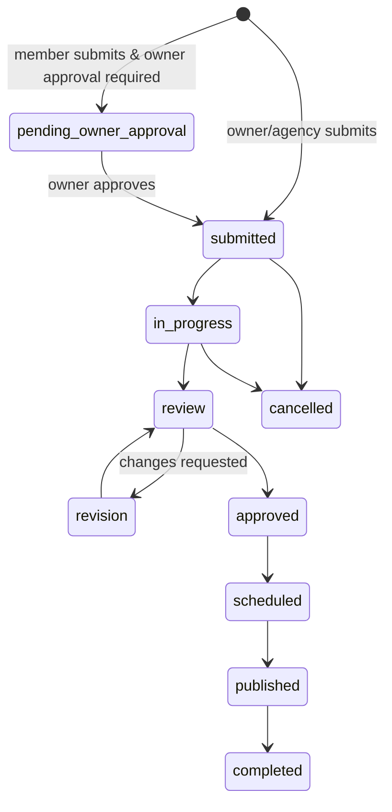

# BilbyDugout — Technical Documentation

**BilbyPixel Client Request Portal.** A multi-tenant work-management platform where agency staff
manage creative requests on behalf of client companies: intake, assignment, review/approval,
scheduling, publishing, brand governance, and billing.

- **Backend** — SlimPHP 4 REST API (PHP 8.2+), Eloquent ORM, Phinx migrations
- **Frontend** — Vue 3 SPA (Composition API), Pinia, Vue Router, TanStack Query, Vite
- **Database** — MySQL 8.0+ / MariaDB 11.x in every environment (development included)

---

## Table of contents

1. [Architecture overview](#1-architecture-overview)
2. [Repository layout](#2-repository-layout)
3. [Authentication](#3-authentication)
4. [Authorization model](#4-authorization-model)
5. [Multi-tenancy & impersonation](#5-multi-tenancy--impersonation)
6. [Backend architecture](#6-backend-architecture)
7. [Request lifecycle (core domain)](#7-request-lifecycle-core-domain)
8. [Feature modules](#8-feature-modules)
9. [API reference](#9-api-reference)
10. [Database schema](#10-database-schema)
11. [Frontend architecture](#11-frontend-architecture)
12. [Configuration reference](#12-configuration-reference)
13. [Local development](#13-local-development)
14. [Scheduled tasks (CLI)](#14-scheduled-tasks-cli)
15. [Integration points](#15-integration-points)
16. [Extending the application](#16-extending-the-application)
17. [Constraints & gotchas](#17-constraints--gotchas)

---

## 1. Architecture overview

A decoupled SPA + JSON API. The browser never talks to Azure AD, Stripe, or social platforms
directly — every integration is brokered server-side so credentials never reach the client.

```
Browser (Vue 3 SPA :5173)
    │  Bearer access token (in memory) + httpOnly refresh cookie
    │  optional X-Impersonate-Client header
    ▼
SlimPHP API (:8080)
    ErrorHandler → CORS → Routing → BodyParsing → JwtAuthMiddleware → Controller
                                                    │
                              Principal (identity + role + tenant scope)
                                                    ▼
                                Service (business rules)  ──►  Policy (authorization)
                                                    ▼
                                Repository / TenantScope (row-level scoping)
                                                    ▼
                                        Eloquent Models → Database
```

**Layering rule:** controllers do no business logic — they resolve the `Principal`, parse the body,
delegate to a service, and serialize. Services own the rules and call policies. Repositories own
tenant scoping. This keeps authorization impossible to bypass by calling a different endpoint.

### Request flow

1. `CorsMiddleware` validates the `Origin` against `CORS_ALLOWED_ORIGINS`.
2. `JwtAuthMiddleware` verifies the HS256 access token, asserts `typ === "access"`, folds in any
   `X-Impersonate-Client` header, and attaches a `Principal` to the request.
3. The controller pulls the `Principal` and hands off to a service.
4. The service authorizes (policy), applies rules, and reads/writes through repositories/models.
5. `JsonErrorHandler` converts every exception into a consistent JSON error envelope.

### Response envelope

```jsonc
// success
{ "data": { ... } }        // or { "data": [ ... ] }, { "ok": true }
// error
{ "error": { "code": "unauthorized", "message": "Invalid or expired token" } }
```

---

## 2. Repository layout

```
bilbydugout/
├── backend/
│   ├── bin/console.php              # CLI entry point for scheduled tasks
│   ├── config/
│   │   ├── routes.php               # single source of truth for the API surface
│   │   └── settings.php             # env-driven config map
│   ├── database/
│   │   ├── migrations/              # Phinx migrations (16)
│   │   ├── seeds/DevSeed.php        # local sample data
│   ├── public/index.php             # HTTP entry point
│   └── src/
│       ├── Application/Bootstrap.php    # DI container, Eloquent, middleware, routes
│       ├── Auth/                        # AzureAdClient, AuthService, JwtService, Principal
│       ├── Console/                     # quota:check, approvals:remind, rss:ingest
│       ├── Domain/
│       │   ├── Enums/                   # Role, RequestStatus, Designation
│       │   └── Models/                  # 35 Eloquent models
│       ├── Http/
│       │   ├── Controllers/             # 29 thin controllers
│       │   ├── Middleware/              # Cors, JwtAuth
│       │   └── Handlers/JsonErrorHandler.php
│       ├── Policies/                    # RequestPolicy, AuthorizationException
│       ├── Repositories/                # RequestRepository, BrandKitRepository
│       ├── Services/                    # business logic (see §6)
│       └── Support/                     # TenantScope, RequestGuard
└── frontend/
    ├── public/bilby-logomark.png
    └── src/
        ├── api/{client.js,endpoints.js} # axios instance + typed API surface
        ├── components/                  # AppShell, charts, settings tabs, drawers
        ├── composables/queries.js       # shared TanStack Query hooks
        ├── constants/                   # permissions, options, chart colors
        ├── router/index.js              # routes + single global guard
        ├── stores/auth.js               # Pinia auth/session/impersonation
        └── views/                       # pages, incl. role-specific dashboards
```

---

## 3. Authentication

### Backend-driven login (production)

Credentials are posted to the API, never to Azure from the browser:

```
POST /api/v1/auth/login  { username, password }
   → AzureAdClient::passwordGrant()   (OAuth2 ROPC)
   → AzureAdClient::validateIdToken()
   → User upsert (users table)
   → resolveScope(email)              (role + tenant, see §4)
   → issue app JWTs
```

The app issues its **own** JWTs rather than passing Azure tokens around, so role/tenant claims are
under application control.

| Token | Storage | TTL (default) | Notes |
|---|---|---|---|
| Access | **In memory only** (Pinia) | `JWT_ACCESS_TTL` = 900s | `typ: "access"`, HS256 |
| Refresh | **httpOnly cookie** | `JWT_REFRESH_TTL` = 30 days | `typ: "refresh"`, `jti` row in `refresh_tokens` |

Access tokens are deliberately **not** persisted to `localStorage` (XSS exfiltration risk). Session
survival across reloads comes from the httpOnly refresh cookie.

**Access token claims:** `sub, email, name, role, designation, client_email, client_role_slug,
staff_role_slug, permissions`.

### Refresh & revocation

- `POST /auth/refresh` verifies the refresh JWT, checks the `refresh_tokens` row is not revoked,
  then **re-resolves scope from the database** and mints a fresh access token. Role changes take
  effect on the next refresh/login — they are not retroactive to issued tokens.
- `POST /auth/logout` sets `revoked_at` on the `jti` row (idempotent, best-effort).

### Dev login (local only)

`POST /auth/dev-login { email }` issues a session with **no password check**. It is gated to
`APP_ENV=local` in the controller and surfaced in the UI only when `VITE_DEV_LOGIN=true`. Never
enable in a shared environment.

| Dev account | Resolves to |
|---|---|
| `admin@bilbypixel.com` | `global_admin` |
| `designer@bilbypixel.com` | `agency_staff` |
| `owner@acme.com` | `client_owner` |
| `member@acme.com` | `client_member` |

---

## 4. Authorization model

### The four roles

```php
enum Role: string {
    case GlobalAdmin  = 'global_admin';   // full control, all tenants
    case AgencyStaff  = 'agency_staff';   // BilbyPixel team
    case ClientOwner  = 'client_owner';   // owns a client company account
    case ClientMember = 'client_member';  // submits under a client company
}
```

`Role::isAgency()` = GlobalAdmin | AgencyStaff.  `Role::isClient()` = ClientOwner | ClientMember.

### Role derivation (`AuthService::resolveScope`)

Roles are **not** stored on the login — they are derived from the directory tables on every
login/refresh:

```
email in team_members (active)?
   └─ is_admin = true  → global_admin      ← explicit flag (legacy: designation === 'admin')
   └─ otherwise        → agency_staff
email in client_members (active)?
   └─ role = 'Owner' OR email = client_email → client_owner
   └─ otherwise                              → client_member
unknown email
   └─ client_owner, tenant = their own email (self-serve fallback)
```

> **Design note.** `is_admin` is a dedicated column precisely so that editing a member's *job title*
> (designation) cannot silently change their access level.

### Manager tier

`Principal::isManager()` = `global_admin` **or** `designation === 'operations_manager'`. Managers get
cross-client capabilities such as impersonation.

### The Principal

`Principal` is the single object every policy and repository scopes against — immutable, built from
JWT claims by the middleware:

```php
userId, email, name, role, designation, clientEmail,
clientRoleSlug, staffRoleSlug, permissions[], impersonatedClientEmail
```

Helpers: `isAgency()`, `isClient()`, `isManager()`, `can($permission)` (global admin always true).

### Permissions

Beyond the four roles, **reusable permission sets** are attached via `staff_roles` / `client_roles`
(slug → `permissions[]` JSON), assigned to members through `staff_role_slug` / `client_role_slug`.
The catalog lives in `frontend/src/constants/permissions.js`.

### Policies

`RequestPolicy` centralizes request rules:

| Action | Rule |
|---|---|
| `view` | Agency → all; client → own `client_email` only |
| `create` | `isAgency() \|\| isClient()` — agency creates on a client's behalf via the client-picker |
| `update` | Agency: manager or assignee; client: own tenant |

Authorization failures throw `AuthorizationException` → HTTP 403. Cross-tenant reads return
**404, not 403**, so the existence of another tenant's record is never leaked.

---

## 5. Multi-tenancy & impersonation

The tenant key is **`client_email`** — nearly every business table carries it.

### TenantScope

```php
TenantScope::apply($query, $principal);        // scopes a read
TenantScope::tenantFor($principal, $requested) // resolves client_email for a write
```

- **Agency** → unscoped (whole workspace); if a *manager* is impersonating, narrowed to that client.
- **Client** → forced to `client_email` — the parameter is ignored, so a client cannot request
  another tenant's rows.

### Impersonation ("View as client")

Lets a manager see the product exactly as a client does — for support and QA.

1. Admin → Clients → ⋯ → **Team** → **View as** on a member.
2. The Pinia store records `impersonation = { email, label }`.
3. The axios request interceptor sends `X-Impersonate-Client: <client_email>` on every call.
4. `JwtAuthMiddleware` folds it into the claims as `impersonatedClientEmail`.
5. Repositories/`TenantScope` honour it **only for managers**.
6. On the frontend, the auth store's **effective role** becomes `client_owner`, so nav, dashboards,
   and route guards all render the client experience. A banner shows "Viewing as … — Exit".

> The impersonation header is a *scope hint*, never an identity claim: a non-manager sending it
> gets nothing, because the server checks `isManager()` before applying it.

---

## 6. Backend architecture

### Bootstrap & dependency injection

`Application\Bootstrap::createApp()` loads `.env` → builds the PHP-DI container → boots Eloquent
(`Capsule::setAsGlobal()`) → registers middleware → loads routes.

Most classes are **autowired** by constructor type-hints. Only these are explicitly bound:

| Interface / class | Bound implementation | Purpose |
|---|---|---|
| `PublishProvider` | `StubPublishProvider` | Social publishing (swap for Meta/LinkedIn) |
| `Mailer` | `OutboxMailer` | Writes to `email_outbox` instead of sending |
| `TeamsNotifier` | `OutboxTeamsNotifier` | Records Teams notifications |
| `LlmService` | `MockLlmService` | Deterministic AI responses, no API key |
| `JwtService`, `AzureAdClient`, `AuthService` | configured with `settings` | Need config injection |

`Bootstrap::bootConsole()` builds the same container without HTTP, for CLI commands.

### Middleware order

Registered in `Bootstrap` as BodyParsing → Routing → CORS → ErrorMiddleware. Slim wraps middleware
**outermost-last-added**, so the actual inbound order is:

```
ErrorMiddleware → CorsMiddleware → Routing → BodyParsing → JwtAuthMiddleware → route handler
```

`JwtAuthMiddleware` is attached per route-group (`->add(JwtAuthMiddleware::class)`) rather than
globally, so `/health` and the `/auth/*` routes stay public.

### Service catalog

| Area | Services |
|---|---|
| Requests | `RequestService`, `CommentService`, `ApprovalService`, `RevisionService`, `ReviewService`, `TimeService`, `ActivityService`, `ActivityLogger` |
| Accounts | `SubscriptionService`, `InvoiceService`, `TeamService`, `NotificationService` |
| Admin config | `Admin\{PlanService, SlaTierService, FormConfigService, DesignationService, RoleService, ClientMemberService}` |
| Brand | `BrandService` + `BrandKitRepository` |
| Publishing | `Publishing\{PublishingService, ChannelService, ProductService, TagRuleService, TagRuleEngine, RssService, BestTimeService, PublishProvider}` |
| Integrations | `Ai\LlmService`, `Mail\Mailer`, `Teams\TeamsNotifier` |

`RoleService` is generic over the model class, serving both `StaffRole` and `ClientRole`.

---

## 7. Request lifecycle (core domain)

### Statuses



### Creation rules (`RequestService::create`)

- Only whitelisted fields are accepted (`FILLABLE`); ownership fields are **server-stamped**
  (`submitted_by_email`, `submitted_by_name`) and never trusted from the client.
- **Agency path** — `client_email` is required (who the request is for); optional `assigned_to[]`;
  status defaults to `submitted`.
- **Client path** — tenant is derived from the caller's `client_members` row. If the submitter is a
  non-owner **and** the subscription has `require_owner_approval`, status becomes
  `pending_owner_approval`; otherwise `submitted`.
- Request + assignee rows are written in a **transaction**.

### Quota

`RequestStatus::activeForQuota()` defines which statuses count toward a client's
`monthly_request_limit` (everything except `pending_owner_approval` and `cancelled`). The
`quota:check` command emails clients at 80% and 100%, idempotently per period.

### SLA tiers

`sla_tiers` are named delivery windows (24/48/72 **hours**, or 1–4 **days**). Service plans
reference a tier by **slug**, so renaming a tier or changing its window propagates to every plan.

---

## 8. Feature modules

| Module | Description | Key tables |
|---|---|---|
| **Requests** | Intake wizard, assignment, status flow, filters | `requests`, `request_assignees` |
| **Collaboration** | Comments (with internal-only flag), approvals with digital signature, revision loops, star reviews, time tracking, activity log | `comments`, `request_approvals`, `revision_requests`, `request_reviews`, `time_entries`, `activity_logs` |
| **Notifications** | In-app bell with unread count (60s poll), mark read/all | `notifications` |
| **Brand Hub** | Multi-brand kits (colors, typography, voice, guidelines PDF), asset library, AI asset review scored against the kit; gated by plan `brand_kit_allowance` | `brand_kits`, `brand_assets`, `brand_asset_reviews` |
| **Publishing** | Content calendar, composer, approval, scheduling, multi-channel targets, best-time suggestions, product tagging, RSS auto-ingest, tag automation rules | `scheduled_posts`, `scheduled_post_targets`, `social_channels`, `post_approvals`, `products`, `content_tag_rules`, `rss_sources` |
| **Clients & billing** | Client accounts, quotas, account managers, client team members, invoices, simulated Stripe portal | `subscriptions`, `client_members`, `invoices` |
| **Admin config** | Service plans (pricing models, trials, setup fees), SLA tiers, form config (service types/tones), designations, staff & client roles | `subscription_plans`, `sla_tiers`, `form_configs`, `designations`, `staff_roles`, `client_roles` |
| **AI assistant** | Draft a request from a prompt; plan recommendations | — (via `LlmService`) |

---

## 9. API reference

Base path **`/api/v1`**. All endpoints require `Authorization: Bearer <access_token>` unless marked
public. Optional `X-Impersonate-Client: <client_email>` (managers only).

### Public

| Method | Path | Notes |
|---|---|---|
| GET | `/health` | Liveness probe (outside `/api/v1`) |
| POST | `/auth/login` | Azure AD ROPC → app JWTs |
| POST | `/auth/dev-login` | **local only** |
| POST | `/auth/refresh` | Rotates access token from cookie |
| POST | `/auth/logout` | Revokes the refresh token |
| POST | `/webhooks/stripe` | Signature-verified |
| GET | `/auth/me` | Authenticated; current principal |

### Requests & collaboration

| Method | Path |
|---|---|
| GET / POST | `/requests` |
| GET | `/requests/{id}` |
| GET / POST | `/requests/{id}/comments` |
| GET / POST | `/requests/{id}/approvals` |
| GET / POST | `/requests/{id}/revisions` |
| PATCH | `/revisions/{revisionId}` |
| GET / POST | `/requests/{id}/reviews` |
| GET | `/requests/{id}/activity` |
| GET / POST | `/requests/{id}/time` |

### Notifications

`GET /notifications` · `POST /notifications/read-all` · `PATCH /notifications/{id}/read`

### Accounts & clients

`GET /subscriptions` · `PATCH /subscriptions/{id}` · `GET /invoices` ·
`GET|POST /client-members` · `PATCH|DELETE /client-members/{id}`

### Settings & admin configuration

Full CRUD (`GET`, `POST`, `PATCH /{id}`, `DELETE /{id}`) on:
`/team-members` · `/designations` · `/staff-roles` · `/client-roles` · `/service-plans` · `/sla-tiers`

`GET|PUT /form-configs/{key}` · `POST /form-configs/{key}/reset` (keys: `service_types`,
`tones_of_voice`) · `POST /uploads` (multipart image)

### Brand

`GET /brand-kits/allowance` · `GET|POST /brand-kits` · `GET|PATCH|DELETE /brand-kits/{id}` ·
`GET|POST /brand-kits/{id}/assets` · `DELETE /brand-assets/{assetId}` ·
`POST /brand-assets/{assetId}/review`

### Publishing

`GET|POST /posts` · `GET /posts/best-times` · `GET|PATCH /posts/{id}` ·
`POST /posts/{id}/{submit|decision|schedule|publish|cancel}` ·
CRUD `/channels`, `/tag-rules`, `/rss-sources` (+ `POST /rss-sources/{id}/ingest`) ·
`GET|POST /products`, `PATCH /products/{id}`

### Integrations

`POST /assistant/draft-request` · `GET /assistant/recommendations` ·
`POST /billing/portal-session` · `GET /outbox`

---

## 10. Database schema

36 tables. Migrations are Phinx, in `backend/database/migrations`, applied in filename order.

### Identity & access
| Table | Purpose |
|---|---|
| `users` | Login identity, `azure_object_id`, last-resolved `role` |
| `refresh_tokens` | `jti` allow-list with `revoked_at` |
| `team_members` | Agency staff directory; **`is_admin`** drives global admin |
| `client_members` | People who submit for a client company |
| `staff_roles` / `client_roles` | Reusable permission sets (`permissions` JSON) |
| `designations` | Staff job titles |

### Work
| Table | Purpose |
|---|---|
| `requests` | Core entity; tenant = `client_email` |
| `request_assignees` | Staff assigned to a request |
| `comments` | Threaded notes, `is_internal` hides from clients |
| `request_approvals` | Client sign-off + digital signature |
| `revision_requests` | Per-deliverable revision loops |
| `request_reviews` | Star rating + written feedback |
| `time_entries` | Time tracking per request |
| `activity_logs` | Immutable audit trail (`from_status` → `to_status`) |
| `notifications` | In-app notification feed |

### Commercial
| Table | Purpose |
|---|---|
| `subscription_plans` | Plans: pricing model, limits, SLA tier, trial, setup fee, image |
| `subscriptions` | A client's active plan, quota, renewal, account managers |
| `sla_tiers` | Named delivery windows (hours/days) |
| `invoices` | Billing records, Stripe customer id |
| `quota_notifications` | Idempotency guard for quota emails |

### Brand & publishing
`brand_kits`, `brand_assets`, `brand_asset_reviews`, `scheduled_posts`, `scheduled_post_targets`,
`social_channels`, `post_approvals`, `products`, `content_tag_rules`, `rss_sources`

### Platform
`form_configs` (JSON `items` keyed by `config_key`), `email_outbox`, `teams_comment_config`,
`client_onboarding_preferences`, `phinxlog`

> **Column-type note.** Migrations use portable `string`/`text` columns rather than native
> `enum`/`json`; Eloquent `$casts` restore enum and array semantics at the model layer. This
> predates the MySQL-only switch and is kept so migrations stay adapter-agnostic for the
> PHPUnit harness.

---

## 11. Frontend architecture

### Routing & guards

One global `beforeEach` guard handles everything:

1. Public route → redirect authenticated users away from `/login`.
2. Not authenticated → `/login?redirect=…`.
3. `meta.roles` doesn't include the **effective** role → bounce to dashboard.

Route groups: `ALL` (dashboard, requests, calendar, analytics, brand, notifications), `AGENCY`
(team-ops, admin), `global_admin` (settings).

> The guard is **UX gating only** — the API is the real enforcement boundary.

### Auth store (`stores/auth.js`)

Pinia store owning session state. Its defining feature is the **effective role**:

```js
role()  { return this.impersonation ? 'client_owner' : this.user?.role }
isAgency()          { return ['global_admin','agency_staff'].includes(this.role) }
isManager()         { return !this.impersonation && (role==='global_admin' || designation==='operations_manager') }
canCreateRequests() { return this.isAgency || this.isClient }   // mirrors RequestPolicy::create
```

Because every component reads these getters, toggling impersonation re-renders the entire app as a
client with no per-component changes.

### API layer

- `api/client.js` — axios instance; request interceptor attaches the Bearer token and impersonation
  header; response interceptor performs a **single de-duplicated silent refresh** on 401 and retries,
  else triggers logout.
- `api/endpoints.js` — 23 grouped API objects (`RequestsApi`, `PlansApi`, `SlaTiersApi`, …), each
  unwrapping `r.data.data`.

### Server state

TanStack Query owns all server state (no server data in Pinia). Shared hooks live in
`composables/queries.js`; query keys are stable strings (`['requests']`, `['sla-tiers']`) so
mutations invalidate precisely.

### Component structure

- `AppShell.vue` — dark-purple sidebar: logomark + "Client Request Portal", grouped nav with inline
  SVG icons and section dividers, collapsible icon-rail (persisted in `localStorage`), user card,
  impersonation banner.
- `views/dashboards/` — `GlobalAdminDashboard`, `AgencyStaffDashboard`, `ClientDashboard`, chosen at
  runtime by `DashboardRouter`.
- `components/charts/` — `LineChart`, `DonutChart`, `ColumnChart`, `BarsChart`: **hand-written SVG,
  no charting dependency**, driven by `constants/chartColors.js`.
- `components/settings/` — one tab component per admin domain.
- `components/clients/` — Clients table plus right-hand drawers (team, edit client).

### Design system

CSS custom properties in `styles.css` (`--bg`, `--surface`, `--border`, `--text`, `--muted`,
`--primary`, `--danger`, `--radius`) with utility classes (`.card`, `.btn`, `.badge`, `.input`,
`.stack`, `.row`). The sidebar overrides these locally for its dark theme.

---

## 12. Configuration reference

`backend/.env` (see `.env.example`):

| Variable | Purpose |
|---|---|
| `APP_ENV` | `local` enables `/auth/dev-login` |
| `APP_DEBUG`, `APP_URL` | Error verbosity, absolute URL base |
| `CORS_ALLOWED_ORIGINS` | Comma-separated SPA origins (e.g. `http://localhost:5173`) |
| `DB_CONNECTION` | `mysql` (only supported value) |
| `DB_HOST/PORT/DATABASE/USERNAME/PASSWORD/CHARSET/COLLATION` | MySQL connection |
| `JWT_SECRET` | **HS256 signing key — must be strong and secret** |
| `JWT_ISSUER`, `JWT_ACCESS_TTL`, `JWT_REFRESH_TTL` | Token issuance |
| `AZURE_TENANT_ID/CLIENT_ID/CLIENT_SECRET`, `AUTH_FLOW` | Azure AD |
| `GRAPH_SERVICE_MAILBOX` | Outbound mail identity |
| `STRIPE_SECRET_KEY`, `STRIPE_WEBHOOK_SECRET` | Billing |
| `ANTHROPIC_API_KEY`, `LLM_MODEL` | AI assistant |

`frontend/.env`: `VITE_API_BASE` (include `/api/v1`), `VITE_DEV_LOGIN` (`true` shows dev sign-in).

---

## 13. Local development

PowerShell, two terminals. If `php`/`npm` aren't on PATH: `$env:Path = "$env:USERPROFILE\scoop\shims;" + $env:Path`

**Terminal 0 — database (:3306)**
```powershell
docker compose up -d db                     # MariaDB 11 with the default credentials
```

**Terminal 1 — API (:8080)**
```powershell
cd bilbydugout\backend
copy .env.example .env                      # first time; set DB_* and JWT_SECRET
composer install                            # first time
php vendor\bin\phinx migrate -c phinx.php   # create/upgrade schema
php vendor\bin\phinx seed:run -c phinx.php  # sample data
php -S localhost:8080 -t public
```

**Terminal 2 — SPA (:5173)**
```powershell
cd bilbydugout\frontend
npm install                                 # first time
npm run dev
```

Open <http://localhost:5173> and use a **Dev sign-in** button. The frontend must run on **5173**
unless you also change `CORS_ALLOWED_ORIGINS`.

**Reset sample data:**
```powershell
php vendor\bin\phinx rollback -c phinx.php -t 0
php vendor\bin\phinx migrate -c phinx.php
php vendor\bin\phinx seed:run -c phinx.php
```

---

## 14. Scheduled tasks (CLI)

```bash
php bin/console.php quota:check        # email clients at 80% / 100% of quota (idempotent per period)
php bin/console.php approvals:remind   # nudge owners on requests pending approval > 48h
php bin/console.php rss:ingest         # pull active RSS sources into scheduled posts
```

Wire into cron / Task Scheduler. Each boots the console container (env + Eloquent + services, no HTTP).

---

## 15. Integration points

Every external dependency sits behind an interface bound in `Bootstrap::definitions()`, so the app
runs **fully offline with no credentials**. Going live means swapping one binding each:

| Interface | Mock (current) | Production swap |
|---|---|---|
| `PublishProvider` | `StubPublishProvider` | Meta Graph / LinkedIn / TikTok clients |
| `Mailer` | `OutboxMailer` (writes `email_outbox`, viewable in Settings → Outbox) | Microsoft Graph sendMail |
| `TeamsNotifier` | `OutboxTeamsNotifier` | Teams webhook / Graph |
| `LlmService` | `MockLlmService` (deterministic) | Anthropic API via `ANTHROPIC_API_KEY` |
| Billing | Simulated Stripe portal | Stripe Billing Portal + webhook |

---

## 16. Extending the application

Adding an admin-managed entity, end to end (the pattern used by SLA Tiers):

**Backend**
1. **Migration** — `database/migrations/<timestamp>_create_x.php`; use `up()`/`down()` when
   backfilling data. Run `php vendor\bin\phinx migrate -c phinx.php`.
2. **Model** — `Domain/Models/X.php` with `$table`, `$guarded = ['id']`, and `$casts` for
   array/bool columns.
3. **Service** — `Services/Admin/XService.php`: `list()` guarded by `isAgency()`, writes guarded by
   `assertAdmin()`; validate in a private `clean()`.
4. **Controller** — thin `index/store/update/destroy` delegating to the service.
5. **Routes** — register in `config/routes.php` inside the authenticated group (autowired; no DI
   binding needed).

**Frontend**
6. **Endpoints** — add an `XApi` object in `api/endpoints.js`.
7. **Component** — a tab under `components/settings/`, using `useQuery` + `useQueryClient`
   invalidation.
8. **Wire up** — add the tab to `Admin.vue` or `Settings.vue` (gate with `auth.role === 'global_admin'`
   where appropriate).

**Rules of thumb**
- Never trust `client_email` from the client for a client-role caller — use `TenantScope`.
- Every new read path goes through a repository or `TenantScope`.
- Keep the frontend gate mirroring the backend policy, and treat the backend as the real boundary.

---

## 17. Constraints & gotchas

- **Role changes need a re-login.** Role is baked into the access token; changing `is_admin` takes
  effect on the next refresh/login, not immediately.
- **CORS is origin-pinned.** The SPA must run on an origin listed in `CORS_ALLOWED_ORIGINS` (5173 by
  default), otherwise login fails silently in the browser console.
- **`APP_ENV=local` is a security switch.** It enables password-less `/auth/dev-login`.
- **A MySQL/MariaDB server is required to run the app**, including locally — there is no file-database fallback. `docker compose up db` provides one.
- **Access tokens are memory-only by design.** A hard refresh always performs a silent refresh —
  expected, not a bug.
- **Cross-tenant reads return 404** rather than 403, deliberately.
- **`frontend/dist/` is build output.** Never edit it; it is regenerated by `npm run build`.
- **Impersonation is scope-only.** It narrows data and swaps the UI role; it does not re-issue a
  token as that user, and all actions remain attributable to the real principal.
